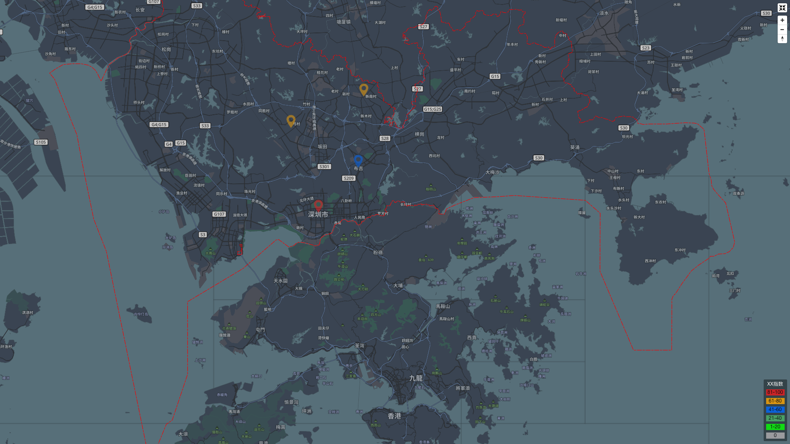

# Mapbox Local-Hosting Demo

`Mapbox` `Mapbox GL JS` `MBView` `MBTiles` `Local-Hosting`

This is a project contains back-end and front-end app for running a self-hosting map by using some tech-stack from **[Mapbox](https://www.mapbox.com/)**.

The MBTiles data of _Shenzhen_ comes from **[openmaptiles.com](https://openmaptiles.com/)**.

## Download 

Clone this repository or download codes from it, and use `yarn` to install packages which the project depends on.

## Startup in Development Mode

Startup front-end app:

~~~
cd ui/ &&  yarn start
~~~

Startup back-end app:

~~~
cd server/ &&  yarn start
~~~

* The front-end app is running at <http://localhost:3000/>.
* The back-end app is running at <http://localhost:4000/>.

Then open your favorite browser to load the page at `localhost:3000`.

## Deploy

Build the front-end(ui) codes to back-end(server):

~~~
yarn build
~~~

Startup your app:

~~~
cd server && yarn start
~~~

Then open your favorite browser to load the page at `localhost:4000`.